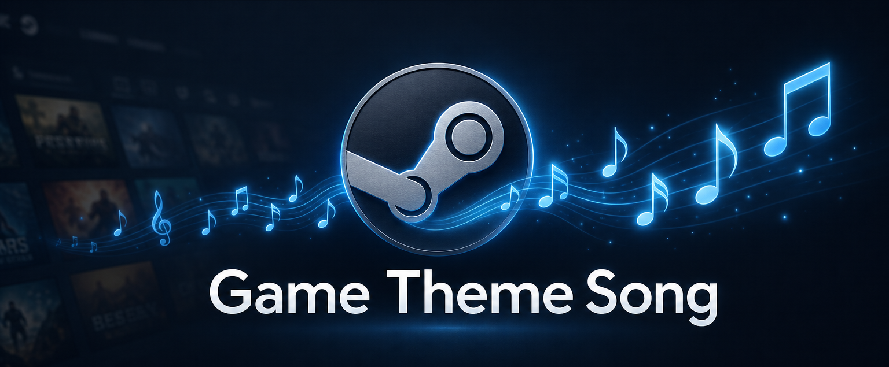

<h1 align="center">Game Theme Song</h1>

  Every game in your library has a soundtrack. 
  Open a game page - its theme music starts playing. No clicks, no setup.

  
  
  
  

  

---

## Features

- **Automatic theme music** - open a game page and its theme starts playing in the background
- **Smart search** - official soundtracks are looked up from multiple sources and scored, so only confident matches play
- **Music note button** - a small note on every game page opens the full control popup
- **Custom tracks** - assign your own audio file to any game, it always overrides the auto search
- **Default song** - a fallback track of your choice for games with no found music
- **Nothing is ever lost** - custom tracks live in a separate folder and are restored automatically after reinstalling
- **Localized** - the interface follows your Steam language: English, Russian, French, German, Italian, Polish, Spanish, Chinese, Japanese, Ukrainian
- **Download manager** - every downloaded track is cached, listed and removable

## Installation

1. Install [Millennium](https://steambrew.app)
2. Open **Millennium** in the Steam menu
3. Choose **Install the plugin** and paste the plugin ID
4. Restart Steam

## How it works

1. You open a game page - the plugin detects the game
2. It looks up the official soundtrack (Khinsider, Internet Archive, SoundCloud) and scores every candidate
3. Only a confident match is downloaded - once, then cached
4. The track fades in, cross-fades between games and fades out when you leave

## The music note button

Every game page gets a small music note button. It opens a native popup with four tabs:

- **Now Playing** - what's playing, with playback controls: keep a new song, find another one, or stop
- **Settings** - volume, fade duration, song length limit, loop, manual search, confirm-before-keep, stop on game launch, interface language
- **Downloaded** - everything cached so far, with size and one-click removal
- **Custom Music** - assign your own track to any game

## Custom music

Open the popup's **Custom Music** tab, search for a game and pick any audio file (MP3, M4A, AAC, OGG, OPUS, WAV, FLAC - up to 50 MB). Your track always plays instead of the auto search.

Everything is stored in `<Steam>/millennium/game-theme-song-custom/` together with the game mapping. This folder survives plugin removal - reinstall and every track is restored automatically.

If a game has no music at all, set a **default song** in Settings - it plays for every game where the search comes up empty.

## FAQ

**Does it slow down Steam?**

No. Tracks are cached after the first play and playback is a single background audio element.

**Does it play over my games?**

No. Music only plays while you browse a game page and fades out when you leave.

**A game got the wrong music?**

Press *Find another* for a different match, or set your own track - your pick always wins.

## License

MIT - see [LICENSE](LICENSE). Not affiliated with Valve or Steam.

  Made for <a href="https://steambrew.app">Millennium</a>

